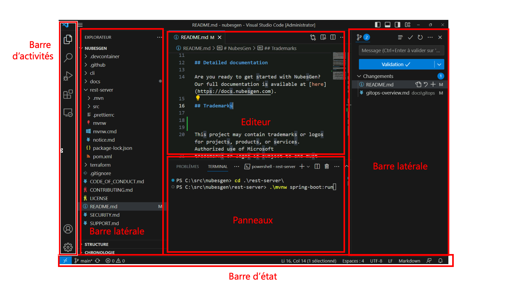
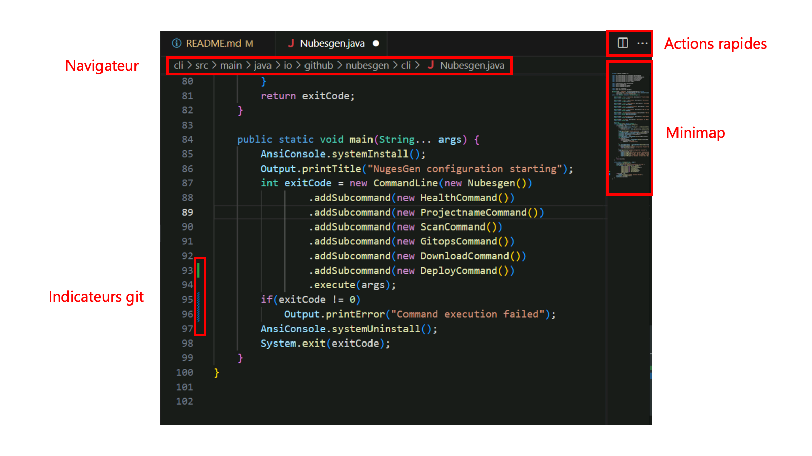

## Get the basics right

<!--
ref: https://code.visualstudio.com/docs/getstarted/userinterface
-->

We will now see the basics of operation and the interface of Visual Studio Code.

### An Overview of the Interface

When you open VS Code for the first time, here are the key elements of the interface you will see:

1. **Activity Bar**: Located on the far left side, it contains icons for the different main views, such as the file explorer, search, extension management, and debug view. The icons in your installation may change depending on the extensions you install.

2. **Sidebar**: Just to the right of the activity bar, it displays the views of one of the selected activity icons, for example, the file explorer. This sidebar can contain interesting information depending on the extensions used - we will see an example later with Git. In the image above, you will also see a sidebar on the right side of the window. This is not the default placement, but you have the option to drag an activity bar from the left to the right. In my case, I place the Git window on the right. Thus, VS Code follows my development process: I select a file on the left, which I edit in the middle, and then I _commit_ on the right.

3. **Edit Area**: This is the heart of VS Code. This is where files will open for editing. We will detail this area a bit later.

4. **Status Bar**: Located at the bottom, it displays information about the open file and the current state of the editor: which language is being used, where the cursor is placed, on which branch you are currently, whether you are working in a container or not, etc.

5. **Panels**: Located at the bottom of the editor, they contain different tools to help you in your tasks. For example, there is an integrated terminal, a debug console, or the output of tools - such as the compiler. Some extensions may also add panels to make your life easier.

### What to Open?

You can launch VS Code without opening anything, but you will need to open something to start working.

The most common use is certainly to **open a folder**. You can thus access the file tree from the sidebar. You can also open or create a new file.

> **Tip**: You can open a file or a folder in VS Code from a terminal simply by using the command `code myfile.txt`.

VS Code also allows you to directly open a Git repository - by cloning it locally -, to connect to a remote server either via SSH or through VS Code "Tunnels".

If you are working on a project whose code is in multiple folders, you can create a _workspace_. This allows you to create a "virtual" file tree that you can simply open with VS Code.

### The Command Palette

The command palette is a very powerful tool in VS Code. It allows you to access numerous features and commands directly with the keyboard.

To open the command palette, you can use the keyboard shortcut `Ctrl+Shift+P` (or `Cmd+Shift+P` on Mac). Once opened, you can simply start typing to search for a command by its name. The most used commands will appear at the top.

It's an efficient way to navigate in VS Code without having to use the mouse, and you will probably discover features that you hadn't noticed before.

> **Tip**: Need to focus? Use the `View: Toggle Zen Mode` command to hide everything superfluous and focus on your code. All you're missing is some background music to get in the zone.

### Keyboard Shortcuts

Keyboard shortcuts are essential for efficient use of VS Code. They allow you to navigate and edit your code much faster than if you were using the mouse. Here are some useful keyboard shortcuts to get started:

- `Ctrl+P` (or `Cmd + P` on Mac): Open a file quickly by its name.
- `Ctrl+B`: Show/Hide the sidebar.
- `Ctrl+/`: Comment/Uncomment a line.
- `Ctrl+D`: Select the next occurrence of the word under the cursor.
- `Ctrl+Shift+K`: Delete the current line.
- `Alt+↑` or `Alt+↓`: Move the current line up or down.
- `Ctrl+Space`: Activate auto-completion.

There are many other keyboard shortcuts available, and they can really speed up your workflow.

> **Tip**: It's possible to get a PDF of a page summarizing all the keyboard shortcuts by selecting `Help: Keyboard Shortcut Reference` in the command palette.

### Focus on the Edit Window

The edit window is full of tools to help you daily. The editor itself integrates many features by default:

- **Syntax highlighting** with very many languages supported. You may need to install an extension for some languages, or choose the right language (on the right in the status bar, or with the `Change Language Mode` command in the command palette).
- **Vertical indentation lines** and **brace coloration** to help you understand the hierarchy levels of your code.
- **Code autocompletion**.

In addition to these functions, you will have several elements around your editor.

All the way to the right, you will find the **minimap**: a visual representation of your code. This map will be very useful when your files contain many lines. Just above, you will find a **quick actions** area. The icon in the previous image allows you to split your editor in two, enabling you to work on two files in parallel. Depending on the languages and extensions, you can have other actions. For example, with Markdown files, it's possible to have a file preview.

The editor area also contains other elements to help you navigate your code. Right at the top of the editor, you will find a navigator allowing you to understand where the current file is located in the file tree of your project. In addition to line numbers, you will find on the left side **Git indicators** that allow you to glance at the code lines you have modified since opening the file. These indicators are also present in the minimap and in the scrollbar located all the way to the right.
