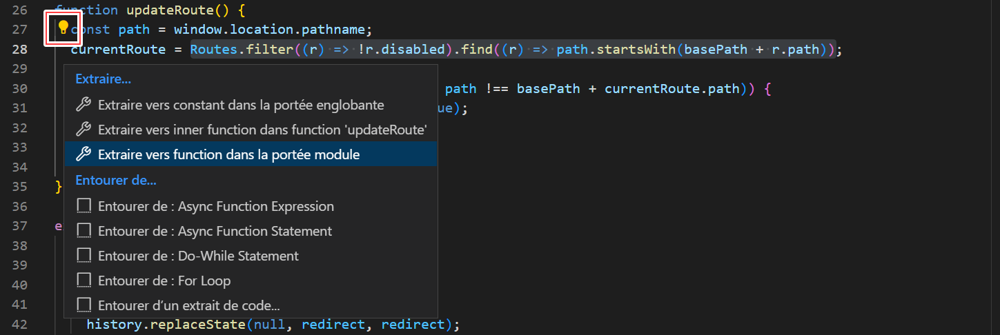
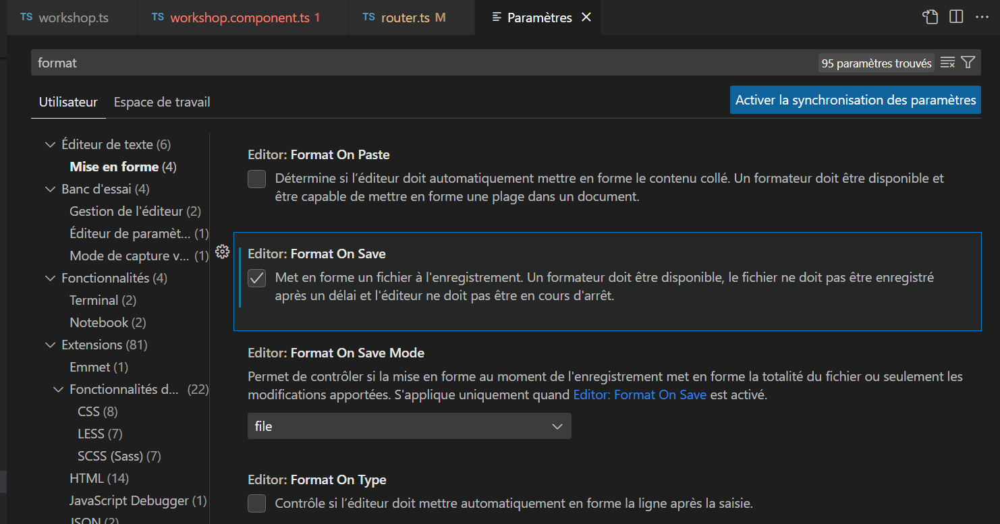

## Advanced Editing Features

When you spend a substantial part of your time editing code, it's important to be able to do it quickly and efficiently. VS Code offers numerous advanced editing features that will save you time and allow you to focus on what's essential.

### Quick Navigation

Navigating quickly among several files is an indispensable task when coding. The most efficient method is to use the shortcut `Ctrl+P` (or `Cmd+P` on Mac). The quick navigation panel then appears, listing the files in your project by order of recent use.


Several options are then available to you:

- If you press `Ctrl+P` (or `Cmd+P` on Mac) again, you will automatically switch to the previously opened file. This is a very efficient method for quickly navigating between two files, for example, when writing unit tests for a class. By holding `Ctrl` (or `Cmd` on Mac) down, and pressing `P` several times, you can go even further back in the history of opened files.
- You can type part of the file name you are looking for, and VS Code will suggest the matching files in your project.
- By adding an `@` after your search, you can search for a symbol in the targeted file. This can be a variable, a function, a class, etc. If you haven't entered a search, this allows you to navigate in the current file.
- By adding a `:` after your search, you access a specific line directly in the targeted file. Just like previously, this also works for the current file.

If you are not familiar with the project structure and the file names, another alternative is to use the shortcut `Shift+Ctrl+.` (or `Shift+Cmd+.` on Mac). This opens the navigation bar (_breadcrumbs_), which allows you to navigate in the current file and go up the hierarchy of your project using the keyboard arrows.

### Refactoring

When writing code, the first version is rarely definitive. Refactoring your code is a major step to make it more readable, maintainable, and performant. Fortunately, VS Code offers numerous features to help you save time during this step.

To quickly rename a variable, a function, or a class, simply position the cursor on it and press `F2` or right-click and select `Rename Symbol`. Once you've entered the new name, either you're confident and you press `Enter` to validate, or you prefer to check the changes before applying them with `Shift+Enter` to open a preview window.


When you select code, a small light bulb will appear at the beginning of the line. Clicking on it will allow you to access specific refactoring actions for the selected code.



Depending on the context, for example, you may extract a function, a variable, or a constant, convert types of loops or imports, and many other things. These actions are also accessible via the shortcut `Shift+Ctrl+R`. Note that this list of actions can also be enriched by extensions.

If you appreciate having a clean and well-formatted codebase, you can also use the shortcut `Shift+Alt+F` to automatically format your code. This works for all languages, and you can even configure the formatting according to your preferences. Depending on the language, you may need to install an extension for it to work, and VS Code will automatically suggest this if needed. To avoid forgetting, you can also configure VS Code to automatically format your code on each save. If you open the settings interface, and search for `format`, you will find the option `Editor: Format On Save` which will allow you to activate this feature.



> **Did you know?** It is possible to easily insert emojis at any time in VS Code thanks to the integrated Emoji Picker. To open it, use the keyboard shortcut `Ctrl+I` (or `Cmd+I` on Mac). You can then search for an emoji by its name, and insert it into your code by pressing `Enter`.

### Multi-Cursor Editing

My favorite feature of VS Code is without doubt the multi-cursor editing. It allows you to edit multiple parts of your code _at the same time_ and save precious time. There are several ways to activate this feature:

- By using `Alt+Click` to add a cursor where you click.
- Via the shortcut `Shift+Ctrl+Alt+Up/Down` (or `Shift+Cmd+Alt+Up/Down` on Mac) to add a cursor on the line above or below the current cursor.
- By selecting a word or a phrase and pressing `Ctrl+D` (or `Cmd+D` on Mac) to select the next occurrence, repeatable at will. It's possible to skip the next occurrence with `Ctrl+K, Ctrl+D` (or `Cmd+K, Cmd+D` on Mac). Finally, the shortcut `Shift+Ctrl+L` (or `Shift+Cmd+L` on Mac) allows you to select all occurrences in one go.

Once your cursors are in place, you can move them with the keyboard arrows, and edit the text normally. But this time, the changes will be applied to all cursors at the same time! This feature is very handy for avoiding repetitive manual modifications, such as adding quotes around each element of an array. It does, however, require a bit of practice to be used effectively.


**Tip**: Navigating within several lines can sometimes be tedious. By using `Alt+Left/Right`, the cursors will move by words and not by characters, which can be very handy when editing JSON properties, for example.

### Snippets

Another way to avoid repetitive tasks is to use _snippets_. These are code templates that you can insert by typing a keyword, then confirming with `Tab`. VS Code already offers some, but it is possible to create new ones or install them via extensions.

Snippets appear in the autocomplete list with `Ctrl+Space`. It is possible to see the list of available snippets for the current language by selecting `Snippets: Insert Snippet` in the command palette. VS Code includes some by default, particularly for JavaScript, TypeScript, Markdown, PHP, HTML, and others.


To create a snippet, select `Snippets: Configure User Snippets` in the command palette. You will then have the option to create snippets for a specific language, in a global file, or only for the current project. Snippets are in JSON format and follow the **TextMate** syntax, here is an example:

```json
{
  "Arrow function": {
    "prefix": "arrow",
    "body": ["const ${1:name} = ($2) => {", "\t$0", "};"],
    "description": "Create an arrow function"
  }
}
```

The `prefix` field corresponds to the keyword that will insert the snippet. The `body` field holds the content of the snippet, and the optional `description` field describes the snippet when it appears in the autocomplete. The `$` are used to define insertion points, and you can quickly move from one point to another with `Tab`. Finally, the `:` of an insertion point as with `${1:name}` allows you to define a default value, here `name`.

VS Code also has built-in support for **Emmet** abbreviations. This is a language that allows generating HTML and CSS code from abbreviations. For example, by typing `div>ul>li*3>span.line$` in an HTML file, VS Code will offer to expand the abbreviation via the autocomplete list. Validate with `Tab` to obtain the following code:

```html
<div>
  <ul>
    <li><span class="line1"></span></li>
    <li><span class="line2"></span></li>
    <li><span class="line3"></span></li>
  </ul>
</div>
```

This syntax is particularly useful for quickly writing HTML and CSS code. For more information on the Emmet syntax, you can consult the official documentation at https://docs.emmet.io.

### Collaborative Editing

Just because we work remotely doesn't mean we have to work alone! Thanks to extensions like **Live Share**, it is possible to collaborate in real-time with your colleagues on the same project, for pair programming or code review, for example. After installing the extension, simply select the new Live Share icon that has been added to the sidebar and click on `Share` to start a collaborative session. You can then invite your colleagues to join the session by sending them the link generated.


Once the session is started, you can see the changes made by your colleagues in real-time, and chat with them via the integrated chat. You can also share your terminal, and even redirect ports to share a local server. You also have the choice to restrict modification rights and terminal access to avoid unpleasant surprises. This is very practical, for example, for doing demonstrations or remote classes!