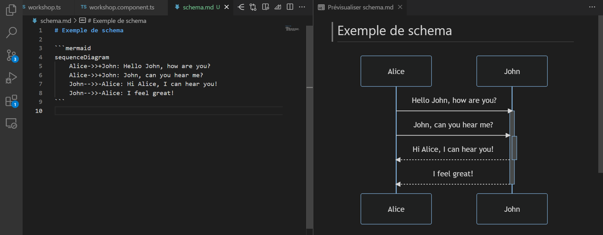
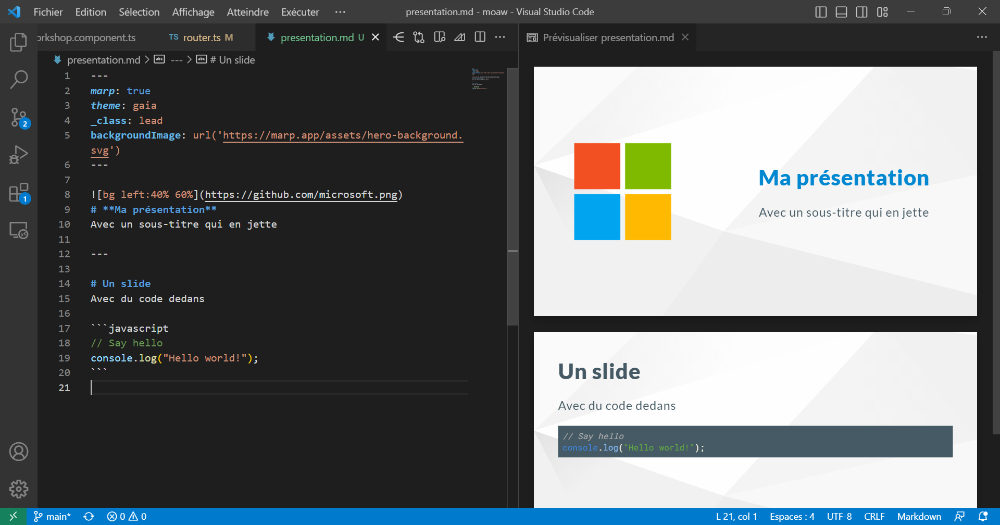

## Going Beyond Code Editing

VS Code has built-in support for _Markdown_, which allows formatting documents using a text syntax that is easy to read and write. Beyond syntactic highlighting and preview (accessible via `Maj+Ctrl+V` or `Maj+Cmd+V` on Mac), the support for this language offers much more than simple document formatting.

### Documentation and Diagrams

Markdown is an excellent language for documenting your projects, but what if you need to create diagrams and schemas to better explain your code?
No worries, there are plenty of extensions for that!

For anything diagram-related, whether they are flowcharts, sequence diagrams, class diagrams, Gantt charts, and more, the **Markdown Preview Mermaid Support** extension is for you. It allows you to use the _Mermaid_ syntax (https://mermaid.js.org) to include and visualize your diagrams directly in your Markdown documents. Your diagrams are defined using a textual syntax in classic code blocks and will be displayed in the Markdown preview.

If you prefer using a drawing tool, the **Draw.io Integration** extension lets you embed the online editor of the same name in VS Code. You can then create and edit your diagrams directly, without leaving VS Code. Even when exported as SVG or PNG, your diagrams remain editable while keeping the file extension `.drawio.png` or `.drawio.svg` if you activate the option, handy!

Another alternative if you like whiteboard drawings is the **Excalidraw** extension, which allows you to create vector drawings directly in VS Code, keeping a "hand-drawn" appearance that can be very appealing for diagrams.

### Organization and Notes

In addition to documentation, Markdown is also quite useful for taking notes and organizing. The **Dendron** extension allows you to organize your notes in a hierarchical knowledge base and link them to files in your project. The tool is also well integrated into VS Code's global search and uses _quick navigation_ to let you navigate through all your notes. You can even export your knowledge base to a website, to share with your colleagues.

When it comes to organizing your daily life, whether for work or personal life, the **Todo Tree** extension is a very handy tool. It allows listing the `TODO` and `FIXME` from all your files and displaying them in a dedicated view, with filters and sorting options. Gone are the `// TODO: fix this` that accumulate and linger in your files, this extension will allow you to easily find and address them.

And if, like me, you like organizing your ideas into mind maps, the **Markmap** extension lets you create mindmaps simply with Markdown lists, and navigate within them directly in VS Code.

### Presentations

You can do almost anything with Markdown, including presentations! The **Marp for VS Code** extension allows creating full presentations in Markdown, and exporting them to PDF, HTML, or PowerPoint. The extension is based on the _Marp_ tool (https://marp.app/), which also includes several basic themes and the possibility to create your own in CSS.

A few lines of markdown are enough to create a presentation, and the extension will do the rest.

As you can see, I’m very fond of Markdown, and its simplicity and flexibility make it a very handy tool to accompany the development of your projects. Limiting the number of round-trips between VS Code and other tools is often a significant time and productivity saver, so don’t hesitate to try these extensions to see if they can help in your projects.